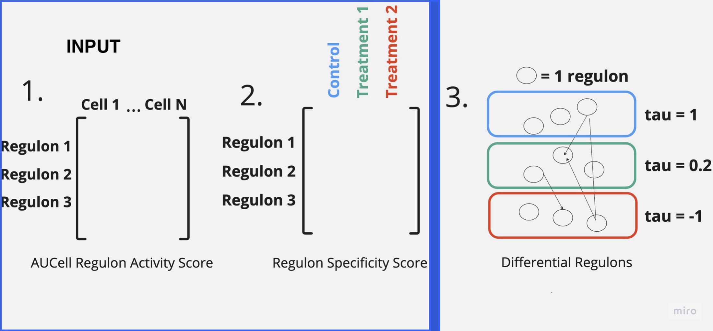

---


# FOX: **F**unctional OMIC  e**X**ploration of Gene Regulatory Networks

FOX is a highly **modular** and **flexible** methodology for analyzing and comparing gene-regulatory networks, especially in single-cell gene expression data. It integrates several advanced tools, including **SCENIC**, **NMF**, and **Kendall's Tau**, to provide deep insights into gene regulation. FOX can be used to visualize, compare, and analyze the structure and activity of gene regulatory networks under different conditions.

Website Documentation: 


 
## Installation (test)

	pip install -i https://test.pypi.org/simple/ FOX==0.0.1

## Usage

To run FOX, you'll need to prepare your data (such as RSS matrices and metadata) and pass it to the class. Here's an example of how to initialize and use FOX:

```python
        data = pd.read_csv("QA_QC_PBMC_rss_values_Feb3.csv") ## this would be one comparison (RSS)
        df_RAS = pd.read_csv("obj_AUC_metadata2_PBMC.csv") ## grab this from your SCENIC stuff, include ALL METADATA AUC AND cellLabels

        labels = data.columns[1:].tolist()

        # your new labels here is your "tissue" or "cell" column
        comparison = ComparisonTree("Naive CD4 T", df_RAS, "newLabels", data, labels, "Unnamed: 0", "3.5_AUCellThresholds_Info_PVMC_QA_QC.tsv")


        comparison.construct_tree() 
        p_vals = comparison.plotRSS_NMF("B", drawQuadrants=True, include_pvals=True)
        comparison.plot_3dEmbedding(rawRSS=False)
        comparison.analyze_factors("B", percentages=True)
        comparison.compareLayers("B", "Naive CD4 T", 0.055)
        tr = comparison.create_global_tree()
        tree, dict = tr

```

## Key Features
- **Layer Comparison**: Compare gene regulatory layers across multiple conditions using dimensionality reduction techniques like **NMF** (Non-negative Matrix Factorization).
- **Gene Activity Visualization**: Visualize the results of gene activity analysis in both **2D** and **3D** embeddings with customized plotting and color mappings.
- **Reproducibility Analysis**: FOX includes methods for assessing the reproducibility of gene-regulatory network structures across different experiments or conditions.
- **SCENIC Integration**: FOX uses SCENIC in combination with AUCell to calculate the activity of each regulon in single-cell data, providing insights into gene regulation.
- **Modular Design**: The core methodology is designed to be easily extendable, making it possible to incorporate additional tools like WGCNA and other network analysis techniques.
- **Broad Applicability**: FOX can be used with a variety of different **gene network libraries** making it a very versatile form if analysis.

## Core Features and Functions

### 1. **Comparison of Gene Regulatory Layers**
   - The `compareLayers` function allows you to compare two gene regulatory layers (e.g., control vs treatment) based on distance, visualizing the differences in a scatter plot.
   - It integrates **NMF**-based dimensionality reduction to plot the relative activity of genes across conditions.

### 2. **Embedding and Analysis**
   - **NMF Transformation**: FOX employs **NMF** to reduce the gene-regulatory data into a 2D space, making it easier to visualize the underlying structure of the networks.
   - **3D Embedding**: It constructs 3D embeddings using **Kendall's Tau** to represent the relationships between conditions and regulons.

### 3. **Global Structure Construction**
   - The `create_global_tree` function builds a hierarchical tree structure of the regulatory network, which can be used to assess the overall network structure and its consistency across conditions.

### 4. **Statistical Analysis and Visualization**
   - **Kendall's Tau**: Computes the correlation between conditions and provides insights into the strength and direction of gene activity.
   - **Component Analysis**: Generate heatmaps to visualize factor contributions and the relationships between regulatory factors under different conditions.

### 5. **Cluster Analysis**
   - FOX uses **KMeans clustering** to group gene activity data, providing a way to identify clusters of genes that behave similarly across conditions.
   - **Quadrant Visualization**: Draw quadrants in 2D plots to divide and analyze clusters based on median values.


### Example Workflow:
1. **Prepare your single-cell gene expression data** (e.g., CSV format).
2. **Initialize FOX** with the necessary data, including control and treatment conditions.
3. **Compare gene-regulatory layers** across conditions using the `compareLayers` function.
4. **Visualize the network structure** using 2D and 3D plots.
5. **Assess the reproducibility** of the regulatory network using the global tree structure.
6. **Analyze factors and clusters** with advanced statistical methods and visualize the results.

## Contributions

Contributions are welcome! Feel free to fork the repository and submit pull requests for bug fixes, new features, or improvements. Help us improve FOX!

---

Let me know if you need further customization or changes! Email: mapostol@unmc.edu
