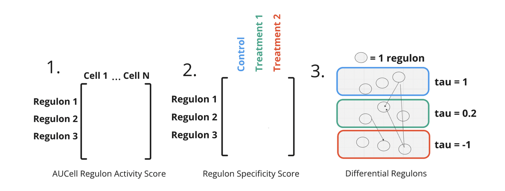

.. FOX documentation master file, created by
   sphinx-quickstart on Mon Feb 17 13:11:38 2025.
   You can adapt this file completely to your liking, but it should at least
   contain the root `toctree` directive.

FOX: Functional OMIC Xploration of Gene Regulatory Networks
===================================================================

See examples:

Quick start guide `<Test_group_final.html>`_

You can view the paper's examples here  `<Test_group_final.html>`_

Installation
------------

To install the FOX package, run the following command:

.. code-block:: bash

	pip install FOXREG

This will install FOX from the Test PyPI repository. Once installed, you can start using the package in your Python projects.
FOX is a highly **modular** and **flexible** methodology for analyzing and comparing gene-regulatory networks, especially in single-cell gene expression data. It integrates several advanced tools, including **SCENIC**, **NMF**, and **Kendall's Tau**, to provide deep insights into gene regulation. FOX can be used to visualize, compare, and analyze the structure and activity of gene regulatory networks under different conditions.

.. toctree::
   :maxdepth: 2
   :caption: Contents:
   
   hdWGCNA_integ_pt2
   intro
   modules

Indices and tables
==================

* :ref:`genindex`
* :ref:`modindex`
* :ref:`search`
